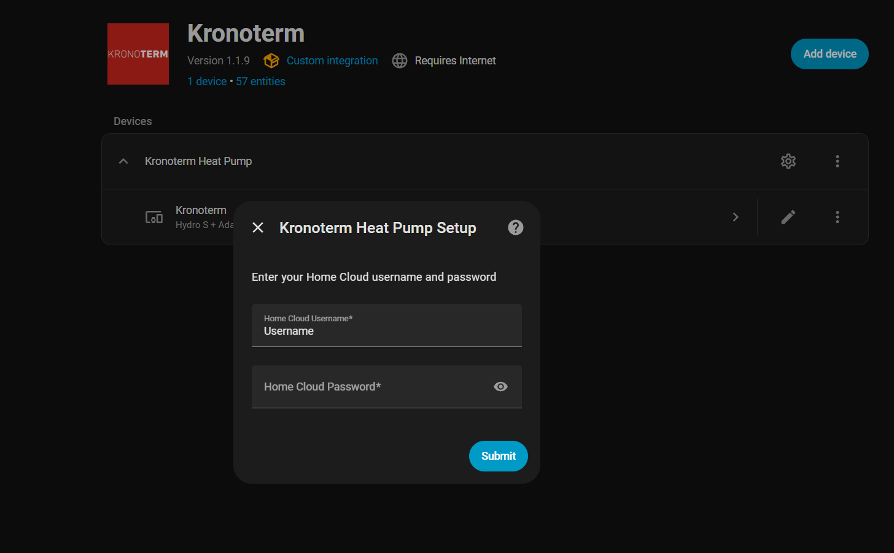
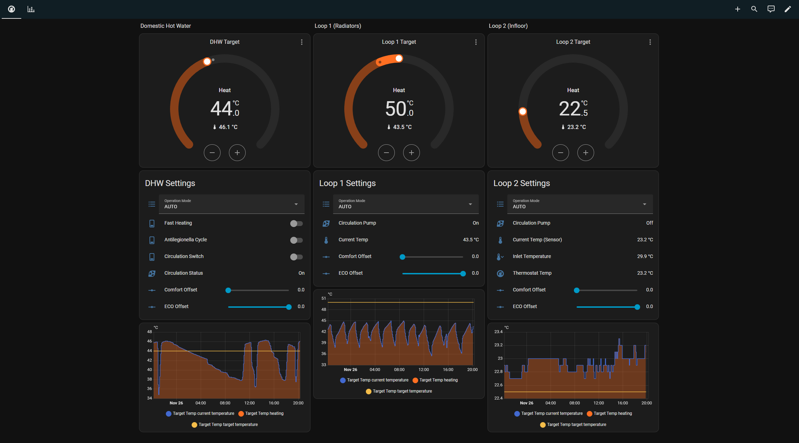
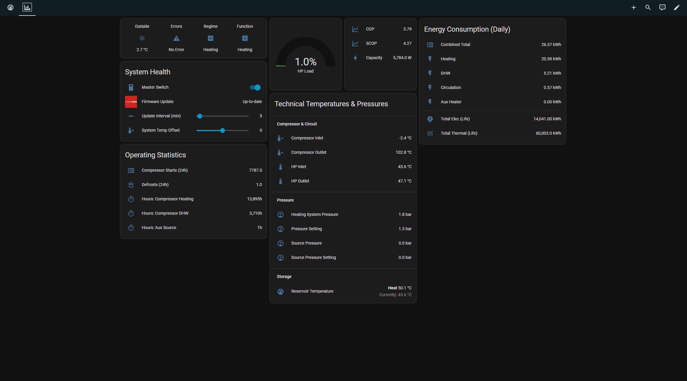
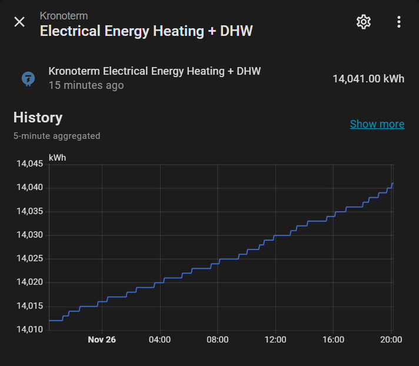

# Kronoterm Integration for Home Assistant

A comprehensive Home Assistant integration for Kronoterm heat pumps, supporting both **Cloud API** and **local Modbus TCP** connections.

## Features

### 🌐 Dual Connection Modes
- **Cloud API**: Internet-based connection using Kronoterm mobile app credentials
- **Modbus TCP**: Local network connection for faster polling and offline operation
- **Seamless switching**: Reconfigure between modes without losing entity history

### 🌡️ Climate Entities (Modbus Mode)
- **4 Climate Controls**: DHW, Heating Loop 1-2, Reservoir
- **Smart Temperature Sensors**: Automatically prefers thermostat temperature over loop temperature
- **Direct Control**: Set target temperatures with instant feedback
- Example: Loop 2 displays room temperature (23.2°C) from thermostat instead of loop outlet temperature (27.8°C)

### 📊 Comprehensive Monitoring
- **100+ Sensors**: Temperatures, pressures, energy consumption, operational hours
- **Binary Sensors**: Status indicators for pumps, compressor, heating/cooling modes
- **Switches**: Control system operation, reserve source, additional source
- **Number Entities**: Adjust temperature offsets and setpoints
- **Select Entities**: Change operation modes and working functions

### ⚡ Performance & Features
- **Fast Polling**: Configurable update interval (5-600 seconds)
- **Energy Dashboard**: Full integration with Home Assistant energy tracking

## Compatibility

Tested with:
- **Hydro S** + Adapt 0416-K3 HT / HK 3F
- Other Kronoterm heat pumps with Modbus TCP support

## Installation

### Via HACS (Recommended)

1. Open HACS → Integrations → ⋮ (Menu) → Custom Repositories
2. Add repository: `https://github.com/Favio25/Kronoterm-homeassistant`
3. Category: Integration
4. Search for "Kronoterm" and install
5. Restart Home Assistant
6. Go to Settings → Devices & Services → Add Integration → Kronoterm

### Manual Installation

1. Copy the `custom_components/kronoterm` folder to your Home Assistant's `custom_components` directory
2. Restart Home Assistant
3. Go to Settings → Devices & Services → Add Integration → Kronoterm

## Configuration

### Cloud API Setup

1. Select **Cloud API** as connection type
2. Enter your Kronoterm mobile app username and password
3. Configure update interval (default: 60 seconds)

### Modbus TCP Setup

**⚠️ Hardware Requirement:**  
Kronoterm heat pumps use **Modbus RTU** (RS-485) by default and do not have built-in Modbus TCP support. You need a **Modbus RTU to TCP adapter** to use local Modbus mode.

**Recommended adapters:**
- [USR-TCP232-410S](https://www.aliexpress.com/item/1005008374731458.html) (Ethernet)
- Elfin EW11 (WiFi option)
- Waveshare RS485-to-Ethernet
- Any RS485-to-TCP converter with configurable serial settings

**Adapter configuration:**
- Baud rate: 19200
- Data bits: 8
- Parity: None (N)
- Stop bits: 1
- Protocol: Modbus RTU

Once connected, configure the integration:

1. Select **Modbus TCP** as connection type
2. Enter your adapter's IP address
3. Port: `502` (default)
4. Unit ID: `20` (default)
5. Update interval: `5-600` seconds

**Finding your adapter's IP address:**
- Check adapter documentation (web interface or LED display)
- Or find it in your router's DHCP list

## Screenshots

### Dashboard

### Energy Monitoring

[Example Dashboard YAML](dashboard.yaml)

## Key Differences: Cloud API vs Modbus

| Feature | Cloud API | Modbus TCP |
|---------|-----------|------------|
| **Connection** | Internet required | Local network only |
| **Speed** | ~60s refresh | 5-600s configurable |
| **Reliability** | Depends on cloud | Direct connection |
| **Climate Entities** | Limited | Full support (4 entities) |
| **Sensors** | ~80 entities | ~120 entities |
| **Offline Operation** | ❌ No | ✅ Yes |

## Advanced Features

### Reconfigure Flow
Switch between Cloud API and Modbus modes without losing entity history:
1. Settings → Devices & Services → Kronoterm
2. Click **Reconfigure**
3. Choose new connection type
4. All entity IDs, history, and dashboard references preserved

### Climate Entity Temperature Mapping
Modbus climate entities intelligently select temperature sensors:
- **Priority 1**: Thermostat temperature (room temperature)
- **Priority 2**: Loop temperature (outlet temperature)
- **Result**: Shows the most relevant temperature for each loop

Example:
- Loop 1 (no thermostat): Shows loop outlet temperature (38.9°C)
- Loop 2 (with thermostat): Shows room temperature (23.2°C) ✨

### Writable Registers
Modbus mode supports direct register writes:
- Temperature setpoints via climate entities
- Temperature offsets via number entities
- System control via switch entities

## Troubleshooting

### Integration Not Showing
- Verify files are in `custom_components/kronoterm/`
- Restart Home Assistant
- Check logs: Settings → System → Logs

### Cloud API Issues
- Verify credentials match Kronoterm mobile app
- Check internet connection
- Some sensors may show as unavailable (normal)

### Modbus Connection Failed
- Verify IP address is correct
- Check port 502 is accessible (firewall)
- Ensure Unit ID is 20 (default)
- Try pinging the heat pump IP

### Entities Unavailable
- **Cloud API**: Some registers not available via cloud (expected)
- **Modbus**: Check network connection and unit ID
- Use reconfigure flow to refresh

## Energy Dashboard Integration

1. Settings → Dashboards → Energy
2. Add electricity consumption: `sensor.electrical_energy_heating_dhw`
3. Add heat production: `sensor.heating_energy_heating_dhw`
4. View COP/SCOP in real-time

## Contributing

Contributions welcome! Please:
1. Fork the repository
2. Create a feature branch
3. Submit a pull request

**Bug reports**: Open an issue with:
- Home Assistant version
- Integration version
- Connection mode (Cloud API / Modbus)
- Relevant log entries

## Credits

- Original integration: [Favio25](https://github.com/Favio25)
- Modbus TCP support and climate entities: Community contributions
- Based on Kronoterm official register documentation

## License

This project is licensed under the MIT License - see the [LICENSE](LICENSE) file for details.

## Disclaimer

This integration is not officially endorsed by Kronoterm. Use at your own risk.

---

**Supported Models**: All Kronoterm heat pumps with Modbus TCP interface  
**Home Assistant Version**: 2023.1.0 or newer  
**Python Version**: 3.11+
